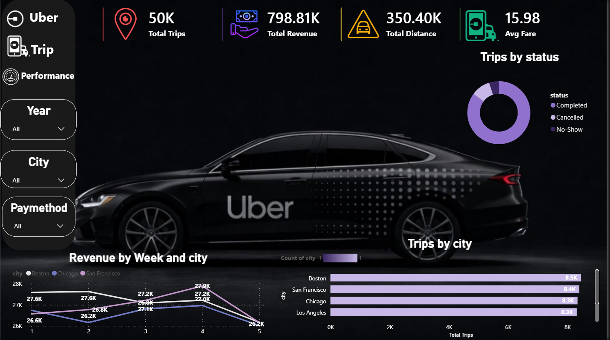

# Uber Trip Analysis Dashboard

An interactive **Power BI dashboard** designed to analyze Uber trip data, identify demand patterns, and provide clear business insights through interactive visualizations.

## 📊 Dashboard Preview



## 🎯 Project Overview

This project transforms Uber trip data into an interactive dashboard that makes it easier to explore trip activity, understand patterns, and identify trends.

The dashboard was designed with a focus on **data visualization, interactive analysis, and business-oriented insights**.

## 🛠️ Tools & Technologies

* **Power BI**
* **DAX**
* **Power Query**
* **Data Modeling**
* **Data Visualization**

## 🔍 Key Features

* Interactive Uber trip analysis
* Trip pattern and trend analysis
* KPI-based overview
* Interactive filters and slicers
* Business-focused data visualizations
* User-friendly dashboard design

## 💡 Business Value

The dashboard provides a clear visual overview of Uber trip activity and helps users explore trends and patterns that can support **data-driven business decisions**.

## 📁 Project Structure

```text
Uber-Trip-Analysis-Dashboard/
├── Dashboard/
│   └── Uber-Trip-Analysis-Dashboard.pbix
├── Screenshots/
│   └── 11.PNG
└── README.md
```

## 👩‍💻 Author

**Sara Basher**

Data Analysis & Business Analysis
